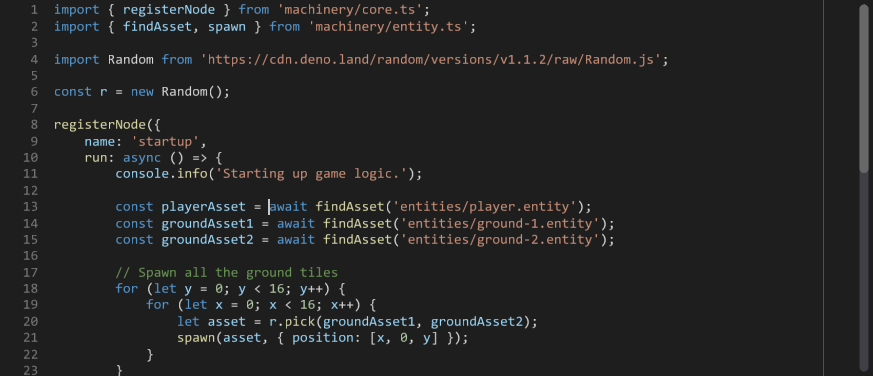

# Anode

Anode is a text editor plugin for [The Machinery] game engine.



[the machinery]: https://ourmachinery.com/

## Features

- Code highlighting, provided by [tree-sitter].
- Easy integration for custom assets (see `tm-anode-api`).

[tree-sitter]: https://tree-sitter.github.io/tree-sitter/

## Crates

- `tm-anode` - Anode text editor plugin for The Machinery.
- [![crates.io]][1] [![docs.rs]][2] - API for the tm-anode The Machinery plugin.
- `tm-textfile` - Text file plugin for The Machinery that showcases basic usage of `tm-anode-api`.

[crates.io]: https://img.shields.io/crates/v/tm-anode-api.svg?label=tm-anode-api
[docs.rs]: https://docs.rs/tm-anode-api/badge.svg
[1]: https://crates.io/crates/tm-anode-api
[2]: https://docs.rs/tm-anode-api/

## Building and Installing

Anode is built using the [Cargo] package manager for [Rust], and can be automatically copied to your
`TM_SDK_DIR` plugins directory using a [cargo-make] task.

```
cargo make machinery
```

[cargo]: https://doc.rust-lang.org/cargo/
[rust]: https://www.rust-lang.org/
[cargo-make]: https://github.com/sagiegurari/cargo-make

## Extending

Anode provides a public API that can be used to extend it.
The API is documented in the `tm-anode-api` crate, and is compatible with the C ABI.

## License

Licensed under either of

- Apache License, Version 2.0 ([LICENSE-APACHE](LICENSE-APACHE) or http://www.apache.org/licenses/LICENSE-2.0)
- MIT License (Expat) ([LICENSE-MIT](LICENSE-MIT) or http://opensource.org/licenses/MIT)

at your option.
